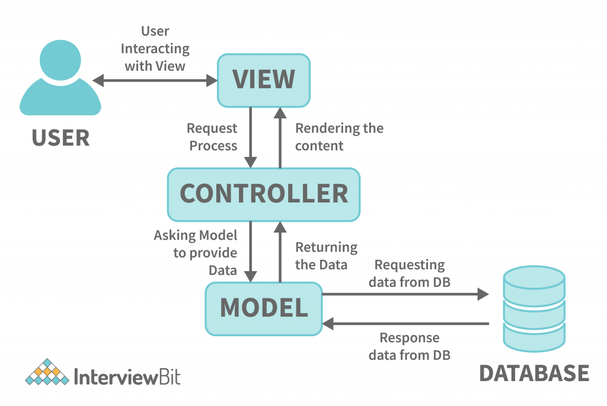

### Login e CRUD com JWT Autenticação 

Este projeto é resultado de um test code.

***
Projeto feito totalmente em PHP 8.2 sem uso de nehnhum framework tanto no frontend quando no backend. 

### **Funcionalidades**
* Login com autenticação JWT
* Validação de token e tempo de experição
* CRUD com POO e MVC
* CSRF token nos formulários
* Validação de força de senha
* Validação de  existência de usuário
* Paginação de resultados
* Direcionamento para rotas e controladores dinâmico 
***

### Explicação do projeto 

>A aplicacão é um simples login usando Json Web Token para garantir a segurando da autenticação, então basicamente ao logar primeiramente é checado se o usuário existe no banco de dados e se as senhas  conferem, passando por essa etapa o usuário é autenticado com um JWT com um prazo para expirar e redirecionado para uma dashboard, na páginas seguintes é aplicada uma validação de token para checar a autenticidade do mesmo. Enquanto o token estiver válido o usuário permanece logado, qualquer alteração no token ou expiração do mesmo o usuário é deslogado.  

Estrutura completa do projeto

Compreendendo a estruturação do projeto em MVC

### Explicando o Código &nbsp;
Agora terá explicação das variáveis utilizadas.

*  **configuration** = pasta que contem uma classe para conexão com o banco de dados.
* **controllers** = passta onde fica todos controladores que fazem o gerenciamento do fluxo da aplicação e regras de negócio.
* **models** = pasta que contêm os modelos do nosso banco de dados para connsultas, listagem, criação, edição e deleção de registros.
* **views** = pasta que contêm as nossas páginas que serão renderizadas para os usuários, tendo tambéms folhas de estilos, scripts JS  ou assets (fontes|imagens) do projeto.
* **.htacess** = arquivo que recebe uma diretriz para encaminhar urls inexistentes para uma view 404.
* **index.php** = Esta index da raiz possui as rotas da aplicação todas as rotas são configuradas de maneira dinâmica nesse arquivo.

### Fluxo básico do JWT &nbsp;

### Fluxo básico do MVC &nbsp;

Agora terá explicação das variáveis utilizadas.

> Basicamente uma rota faz a requisição de uma view, neste momento o controlador entra em ação e chama um model ou aplica alguma regra de negócio, o model faz uma requisição para banco de dados que devolve uma resposta, que por sua vez  entrega de volta ao controlador e o controlador chama a view passando os dados.

### Gif da aplicação;

## Clone esse projeto
 
<strong> Pré requisitos </strong>   

- [Composer](https://getcomposer.org)
- [dotenv](https://packagist.org/packages/vlucas/phpdotenv)
 
 <strong>Instalação</strong> 

$ git clone https://github.com/bywilliams/login_jwt_mvc.git
 
 
